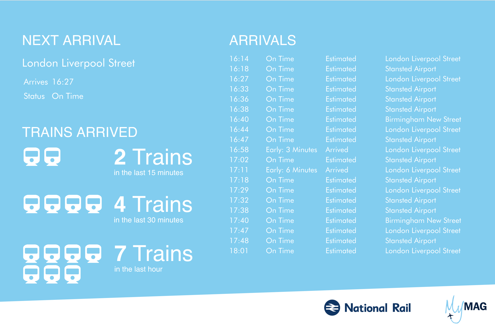

theme: Fira Elastic
footer: 
autoscale: true

<!--
TODO: work slides showing actual Hello World Kafka + ES setup into this. If there's time in 10-15 min a demo of the same could be done instead.
-->

## Analysing real-time data with the Elastic Stack
###  Emanuil Tolev　　　@emanuil_tolev

---

# 
## Community Engineer

---

# Data and the cognitive problem of search

---

## Who considers themselves to work with real-time data?

---

# "Real-time"

^ subject to real-time constraints
Typically interacting with the real world
Making decisions that affect the world
A lot of marketing in recent years, especially in the web monitoring space.

---

# Deadlines

^ Subject to "deadlines", typically within ms
Considered a failure if cannot respond to request within deadline
Deadlines must always be met regardless of system load.

---

### Be very careful if you go into making decisions with *ms* deadlines
### and are using a datastore typically used by web devs

^ Elasticsearch, like many other datastores, definitely does not guarantee its responses under heavy load. Nowadays it's pretty good at handling load well.

---

## So what can you do? A lot.

---

### Make it the destination for data at rest
### Have quick guaranteed processing on the fly and store the summary

---

## Let's look at some cars

^ Oliver Eilhard, the maintainer of the community Go client for Elasticsearch, was into racing a few years back.

---

# The VLN

^ a series of 10 races over 4-6 hours taking place at a 21km race track in Germany.
At the VLN, you typically see about 200 cars on the track, ranging from Porsche 911s to Ferrari 458s and Opel OPCs, all racing at the same time and at (very) different speeds.
Obviously, overtaking is not the exception, but the rule here.

---

---

## Found they were a bit slower. What to do?

---

# Some engineering!

- gather data
- analyse it

^ they found that they were slower than their competitors in similar cars. So what do good engineers do? First, they gather data. Second, they analyze it. And that's exactly what they did, using Elasticsearch.

---

# Alright, what do we have?
- location
- speed

^ you can get a ton of data from a race car
Getting data from only their car didn't solve the problem.
You then only have data from one car, and you need data from the competitors as well. So they came up with a different solution.

---

## The Racing App

^ The app tracks the exact location of every car on the track and streams it over the internet. While GPS-over-IP is not as exact as GPS data from the cars themselves, it's available for every car and, as it turns out, good enough for us to solve our problem.

---

## Data source -> proxy -> Elasticsearch
## pretty typical

^ So, we wrote a proxy to record data on the wire and stored it in Elasticsearch. Looking at the data, we found that not only is the latitude and longitude of every car provided, but also its speed, steering wheel position, and some other metrics. Nice.
^ *The point here is that ES is not really real-time. It will respond within many seconds under load. Use it as endpoint for all data at rest or divert analysis of the real-time stream into it, but don't make it a dependency of the RT system.*

---

---

### geo-queries and geo-filters in Elasticsearch to find entry and exit times
### each car, every sector

^ Given enough laps, that gave us a good estimate of where we lost time. We even tracked time loss down to individual corners of the track.

---

^ nice PDF of the results

---

# Wake up :) before demo.

^ see demoscript.md

---

## Who's done analytics on a real-time data stream? What was it?

^ if you're given a really long slot

---

## One more cool thing - airport security

^ Cool? :D

---

### Crimson Macaw for Manchester Airport Group (MAG)
### real-time dashboards for Airport Security Operations at London's Stansted Airport

---

### National rail data

### STOMP input -> Logstash -> Elasticsearch

^ An example being National Rail data, which we loaded into Elasticsearch using the STOMP (Streaming Text Oriented Messaging Protocol) interfaces.

^ This in itself presented some initial challenges that we had to overcome:

^ Polling for data from databases had to be more frequent than 1 minute
Incoming data from STOMP was gzip compressed

^ Had to write a plugin to allow Logstash to understand gzip logstash-codec-gzip

---

^ *Repeat: The point here is that ES is not really real-time. It will respond within many seconds under load. Use it as endpoint for all data at rest or divert analysis of the real-time stream into it, but don't make it a dependency of the RT system.*

<!-- TODO: slide showing 2 typical scenarios of RT data use in ES. -->

---

# Questions?
### Emanuil Tolev　　　　　@emanuil_tolev
### etolev@elastic.co
